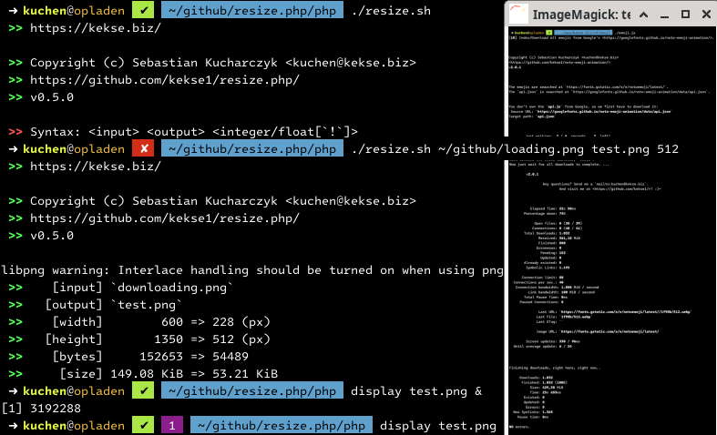

# Index
1. [Overview](#overview)
2. [Usage](#usage)
3. [Configuration](#configuration)
4. [Download](#download)
5. [Dependencies](#dependencies)
6. [Formats](#formats)
7. [Screenshot](#screenshot)
8. [Bugs and TODO](#bugs-and-todo)
9. [Copyright and License](#copyright-and-license)

# Overview
Just a image resizer; but it supports both **BROWSER** and **CLI** mode!
Either by real target pixel size, or by a floating point factor.

The output image will keep proportions, unless you define the **quad mode** (via
**`?quad`** GET param in the browser, or with a **`!`** size suffix in the console).

## Usage
In the **browser** you can call this script via `...?input=file&size=(int|float)[&quad]`. In the **command line** you'll see the
syntax by just calling this script w/o (or with less than 3) parameters. The regular syntax is: `$0 <input file> <output file> <(int|float)[!]>`.

The **`!`** sign after an (integer!) size is the replacement for the browser's `?quad`, so the resulting image won't be
scaled in it's proportions, but result in a quadratic image. A **float** size (needs to be greater than 0.0 and lower than 1.0)
will scale the image by this ratio, an **integer** will result in this real pixel size.

> **Warning**
> **UP**-scaling is _never ever_ allowed, only **DOWN**-scaling.. so the output image always needs to be smaller than the input image;
> which is one the one hand because larger outputs never got the same quality, and, on the other hand (which weights even more!) so
neither the disk drive nor the bandwidth/traffic is affected that much! **;)~**

> **Note**
> In the BROWSER, the output image will directly be written (with appropriate `Content-Type` header), whereas in the
> command line you've to specify an output file (path)!

## Configuration
.. is simply put on top of the script:

| define()'d **KEY**             | Default **VALUE** | Meaning                                                                   |
| -----------------------------: | :---------------- | :------------------------------------------------------------------------ |
| **`KEKSE_RESIZE_DIRECTORY`**   | `getcwd()`        | For relative paths this will be inserted at their beginnings.             |
| **`KEKSE_RESIZE_ANY_BROWSER`** | `true`            | `any` means any input image ... and no output pixel limit of 512 ..       |
| **`KEKSE_RESIZE_ANY_CLI`**     | `true`            | .. otherwise only emojis are supported (file type and file size limits).. |

## Download
* [**`resize.php`** v**0.5.3**](php/resize.php)
* [**`resize.sh`** wrapper](sh/resize.sh)

## Dependencies
* [`count.php`](https://github.com/kekse1/count.php/)

This `count.php` dependency because I just wrote really nice functions in there (yes, it's my own implementation), so
e.g. the most used `getParam()`, which is a really secure way of handling the `$_GET[]`, also with paths (so injection
is not really possible here, e.g.).

It also got nice console features (with ANSI colors, styles, etc.); and especially for such cases I also coded there the
`KEKSE_RAW` feature, to use everything in other scripts, without the real `counter()` function to be called automatically.

The `count.php` needs to be located in the same directory where this script is put into. A symbolic link is also valid! ;)~

## Formats
Supported image formats are:

* JPEG
* PNG
* WebP
* GIF

Due to my sanity the output image will also be the same format as the input image (that's what I decided due to image
quality concerns.. or do you really want to convert images to other formats? => feel free to ask me..).

> **Warning**
> If the `any` configuration is not enabled, we're limited to emoji input images, so then only `WebP` and `GIF` are usable.

## Screenshot

## Bugs and TODO
_Problem_ is (**here**!): I also wanted to resize animated emojis, but animation seems not to be supported.. at least in my
PHP version with it's own GD library.. additionally I've got problems with `WebP (.webp)` images; dunno..

And the TODO, especially for _thumbnails_, is: a **cache** in the file system! So only one time necessary (for each requested size!!).
But that's somewhere in the future, I'm not going to support this script as much as my other ones.. just got no more time.

## Copyright and License
The Copyright is [(c) Sebastian Kucharczyk](COPYRIGHT.txt),
and it's licensed under the [MIT](LICENSE.txt) (also known as 'X' or 'X11' license).
